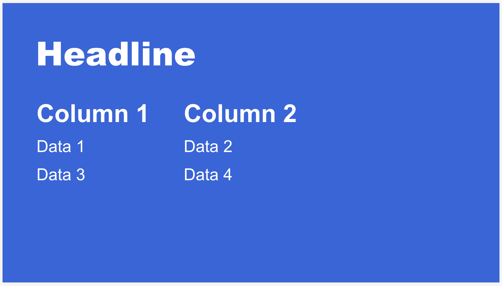

# Data template

## Data format

Expects data in the following format:

<pre>

# First element of array is the header element. This contains the
# title of the column and which field in the following array elements
# should be shown in the column.
# The following array elements are the row data.

[
    {
        "type": "header",
        "columns": [
            {
                "title": "Column 1",
                "field": "column1"
            },
            {
                "title": "Column 2",
                "field": "column2"
            }
        ]
    },
    {
        "column1": "Data 1",
        "column2": "Data 2"
    }
    {
        "column1": "Data 3",
        "column2": "Data 4"
    }
]

</pre>

The data above will give the following rows:

